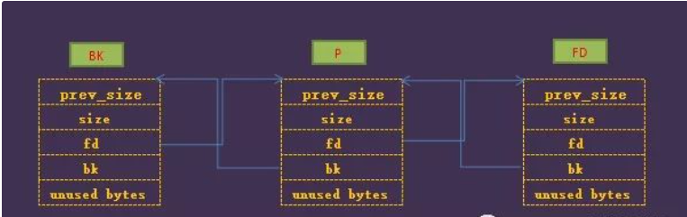

# ezChunk(unlink+offbynull)

## 分析一下题

- 进入 addemo函数内部 查找关键结构体

  - st数据看起来是关键

  - `(_DWORD *)&st_next12 + 10 * i` 这个是存size的
  - `(_QWORD *)&st + 5 * i`这个是emo content的内容
  - `(char *)&st + 40 * i + 20`是存name的
  - `*((_DWORD *)&st_next8 + 10 * i)`存使用情况

- 我们这里开始简单运算一下 这个数组到底是怎么存放数据的 指针为char类型

  - 存size:		point + 40 *i +12 存 int类型
  - 存content :point + 40 *i 存一个结构体指针
  - 存name:    point + 40*i +20
  - 存使用情况:point +40*i +8 存一个int

  - 所以每个元素:

    ```golang
    type emo struct {
       	Content *string  // 0-8
        IsUsed 	int	// 8-12
        Size    int	// 12-16
        index   int // 16-20
        Name 	string[16] //20-36
    }
    ```

## chunk分析

- 在addemo的时候name malloc(0x10) 马上free了 但是没有清空
  - emo content的时候malloc(size)

- 在delemo的时候是根据emo.isused来判断是否存在的
  - emo.content被清空 并且被清空
  - emo.isused被设置为0
- editemo的时候是根据判断emo.content是否为空去编辑的
  - 直接向emo.content中写入内容

- printemo是根据emo.content是否为空去判断的
  - 然后直接打印出来

## 漏洞学习

> 这题存在off_by_null漏洞

构造heap overlap 触发unlink漏洞

### 先学习unlink漏洞

> 学习文章:[一道题彻底理解 Pwn Heap Unlink-腾讯云开发者社区-腾讯云 (tencent.com)](https://cloud.tencent.com/developer/article/1557872)

- 明确一下对象`双向链表`

**宏定义**

```c
#define unlink(AV, P, BK, FD)
```

> - P： 待脱链的空闲chunk的指针
> - BK：后一个chunk的指针
> - FD：前一个chunk的指针

#### 流程

- **大小检查**

  - ```c
    if (__builtin_expect (chunksize(P) != prev_size (next_chunk(P)), 0))   
          malloc_printerr ("corrupted size vs. prev_size");
    ```

  - 检查下一个chunk的prev_size是否与p的大小相同

- **获取fd与bk**

  - 通过p的fd/bk去获取前面一个chunk的`fd`和后面一个chunk的`bk`

- **检查**

  ```c
  if (__builtin_expect (FD->bk != P || BK->fd != P, 0))            
        malloc_printerr ("corrupted double-linked list");
  ```

  - 这里很关键因为会检查前后chunk中 fd或者bk 指向的是否是p chunk

  - 这里等效为:

    ```c
    P->fd->bk == P <=> *(P->fd + 0x18) == P 
    p->bk->fd == P <=> *(p->bk + 0x10) == P
    ```

  - 那么就很明确了
    - 将`p->fd`置为 **(&p-0x18)**
    - 将`p->bk`设置为 **(&p-0x10)**

- 脱链

  - `FD->bk = BK` 与`BK->fd = FD`

    ```C
    FD->bk = BK <=> P->fd->bk = p->bk <=> *(P->fd + 0x18) = P->bk //Ⅰ
    BK->fd = FD <=> P->bk->fd = p->fd <=> *(P->bk + 0x10) = P->fd //Ⅱ
    ```

    - 等效为:` P->fd->bk = p->bk`与` P->bk->fd = p->fd`

    > 这里相当于让前后的chunk连接起来了 把中间的chunk忽略掉


### 调试技巧

- heap可以查看当前的chunk

  

## 学习路线:


​                                                                                                                                                                                                                                                                                                                                                                                                                                                                                                                                                                                                                                                                                                                                                                                                                                                                                                                                                                                                                                                                                                                                                                                                                                    
